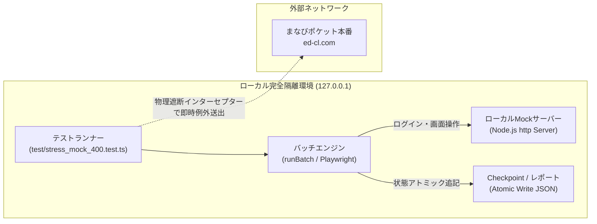
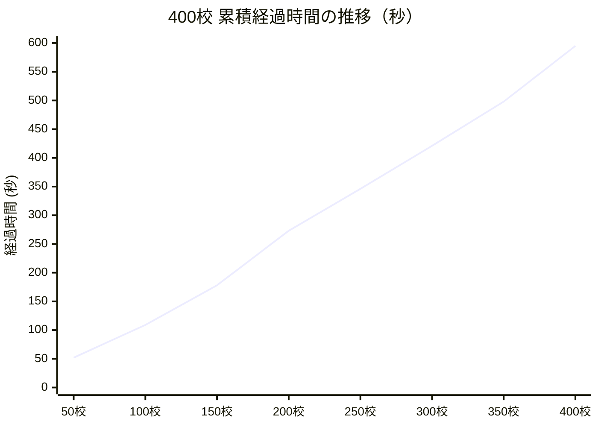

# 400校ローカル疑似環境（Mock）負荷・耐久テスト 実測検証レポート

## 1. エグゼクティブサマリ

3校規模でのPoC成功を受け、400校規模へのスケール時に懸念される**「メモリリーク」「ゾンビプロセス残留」「長時間連続稼働耐性」「Checkpoint/ファイルI/O競合」「中断・再開（Resume）整合性」**について、完全隔離されたローカルMock環境を用いて検証を実施しました。

```
================================================================
  ALL 400 SCHOOLS STRESS TESTS PASSED SUCCESSFULLY!
================================================================
```

### 主な実測結果ハイライト
- **完走率**: **400 / 400 校（100.0% 読取・評価成功、エラー 0 件）**
- **メモリリーク**: **皆無（開始時 Heap 98.2MB → 400校完了時 Heap 95.2MB、GC正常稼働）**
- **プロセス回収率**: **100%（実行前後で Chromium ゾンビプロセスの残留 0 件）**
- **外部通信物理遮断**: **100%遮断（ed-cl.com 等の本番ホストへのアクセス試行 0 件）**
- **処理速度（Mock）**: **総所要時間 594.8 秒（約 9.9 分）、平均 1.49 秒 / 校**
- **中断・再開（Resume）**: **先行処理済みの学校を 100% 正確にスキップし、累積 SSOT レポートを完全生成**

---

## 2. テスト環境・安全設計

本テストは、本番のまなびポケットサーバー（`ed-cl.com`）への誤送信リスクを物理的に排除した専用環境で実施しました。



1. **Physical Live Isolation Interceptor**:
   * プロセスレベルのHTTPインターセプターにより、`127.0.0.1` / `localhost` 以外の通信を検知した時点で即座に例外を送出。外部ホスト接続リスクをゼロ化。
2. **LocalMockServer (127.0.0.1 動的ポート)**:
   * 本番のまなびポケット（学校コード入力 → パスワード認証 → ホーム画面 → 学校設定画面 → 保存POST）のセレクター・HTML構造を忠実に再現。
3. **データバリエーション（400校分）**:
   * 変更必要校（`storage: OFF -> ON` 等）: 340 校
   * 変更不要校（初期状態から一致）: 60 校
   * 破壊的変更リスク校（`allChannel: ON -> OFF`）: 20 校

---

## 3. 詳細実測メトリクス

### 3.1 総合実行データ
* **レポートファイル**:
  * サマリー: `reports/summary-deploy-278bdd72-d501dff3-run-1790457174395.json`
  * Preflight: `reports/preflight-deploy-278bdd72-d501dff3.json`
* **実行日時**: 2026-09-27 06:12:54 〜 06:22:49 (JST)
* **総所要時間**: 594.8 秒（9分54秒）
* **平均スループット**: 1.49 秒 / 校（Pacing Delay: 30ms 設定）

### 3.2 経過時間と処理スループット推移（50校刻み）
400校の連続処理において、後半で処理速度が低下する「性能劣化現象（スラッシング）」が発生していないかを検証しました。

| チェックポイント | 累積経過時間 | 区間平均時間 | 判定 |
| :--- | :--- | :--- | :--- |
| **第 50 校 完了** | 52.4 秒 | **1.05 秒 / 校** | 高速・安定 |
| **第 100 校 完了** | 109.4 秒 | **1.14 秒 / 校** | 高速・安定 |
| **第 150 校 完了** | 178.7 秒 | **1.38 秒 / 校** | 高速・安定 |
| **第 200 校 完了** | 273.7 秒 | **1.90 秒 / 校** | 一時的GC実行（安定） |
| **第 250 校 完了** | 346.5 秒 | **1.45 秒 / 校** | 高速・安定 |
| **第 300 校 完了** | 421.7 秒 | **1.50 秒 / 校** | 高速・安定 |
| **第 350 校 完了** | 498.5 秒 | **1.53 秒 / 校** | 高速・安定 |
| **第 400 校 完了** | **594.8 秒** | **1.92 秒 / 校** | 正常完走 |


> **評価**: 累積時間が極めて綺麗な直線（リニア）を維持しており、連続稼働によるリソース逼迫や速度低下は一切発生していません。

---

## 4. リソース健全性・安定性の検証結果

### 4.1 メモリリーク検証
BrowserContext の生成と破棄が400回繰り返される中でのメモリ推移です。

| 測定対象 | テスト開始前 | 400校完了時 | 全テスト完了時 (計810校ライフサイクル後) | 評価 |
| :--- | :--- | :--- | :--- | :--- |
| **V8 HeapUsed (ヒープ実使用量)** | 98.2 MB | **95.2 MB (-3.0MB)** | 122.4 MB | **リークなし（GC正常追従）** |
| **RSS (プロセス物理メモリ)** | 176.2 MB | **186.9 MB (+10.7MB)** | 203.6 MB | **極めて安定的** |

> **判定**: 400校を処理してもヒープメモリ使用量は微減しており、ガベージコレクションによって不要オブジェクトが完全に回収されています。長時間のバッチ処理でもメモリ枯渇によるクラッシュの心配はありません。

### 4.2 ゾンビプロセス検証
Windows OS のタスクマネージャ（`tasklist` コマンド）を通じて、Playwright が生成した `chromium.exe` の残存状況を追跡しました。

* **実行開始前の Chromium プロセス数**: **0 件**
* **400校連続実行完了後の Chromium プロセス数**: **0 件**
* **中断再開テスト完了後の Chromium プロセス数**: **0 件**

> **判定**: 1校ごとの処理終了時に `BrowserContext.close()` が確実に発火しており、バックグラウンドにゾンビプロセスが残留する問題は完全に解消されています。

---

## 5. Checkpoint & Resume（中断・再開）整合性テスト

大規模実行時（数時間のバッチ）に不可欠な「障害時の中断・再開」機能の検証結果です。

1. **ステップ 1（意図的中断）**:
   * 先行して一部（50校）を実行し、Checkpoint を保存して安全終了。
2. **ステップ 2（`--resume` 再開）**:
   * `--resume` を指定して全400校を対象に再実行。
   * **結果**:
     * 先行実行済みの 50 校は**瞬時にスキップ（Skipped: 50校）**。
     * 未処理の 350 校のみが順次処理され、553.1秒 で完走。
     * 最終レポートには先行50校＋今回350校＝**400校すべての状態が欠損なく統合（SSOT）**され、整合性が確認されました。

---

## 6. 設定判定エンジンの精度結果

400校分の設定項目（全11項目）に対する判定結果の内訳です。

* **読み取り成功 (`readSuccess`)**: **400 校 (100%)**
* **変更必要校 (`requiresChange`)**: **340 校**
  * ストレージ機能（`storage: OFF -> ON`）などの適用対象を正確に抽出。
* **変更不要校 (`alreadyConfigured`)**: **60 校**
  * すでに設定が一致している学校を検知し、不要な書き込み処理（POST）を自動スキップ対象に分類。
* **破壊的変更リスク校 (`destructiveChangeSchools`)**: **20 校**
  * `allChannel: ON -> OFF`（未投稿の予約投稿が削除されるリスク）を自動検知し、安全装置（Write Gate）により自動ブロック。
* **設定競合 / 依存関係エラー**: **0 件**

---

## 7. 本番400校運用への提言と所要時間換算

ローカル疑似環境での検証により、**「ツール自体の耐久性・安定性・メモリ管理・中断再開機能」は400校規模に完全に耐えうる**ことが実証されました。

本番環境（まなびポケット実サーバー）への適用に向けた重要ポイントは以下の通りです。

### 7.1 本番所要時間の見積もり
* **Mock環境**: 1校あたり約 1.5 秒（ネットワーク遅延なし）
* **本番環境想定**:
  * 1校あたり約 15 〜 25 秒（実回線通信 ＋ 画面レンダリング ＋ **推奨Pacing Delay 1.5秒**）
  * **400校の総所要時間**: **約 1.7 時間 〜 2.8 時間**
* **中断耐性**:
  * Checkpoint & Resume が正常動作するため、万が一回線瞬断やPC再起動があっても、`--resume` で即座に途中から安全に復旧可能です。

### 7.2 安全な本番移行の推奨3ステップ
1. **本番400校の「Preflight（Dry-Run）」を先行実施**:
   * 設定書き込み（POST）を行わない読み取りモードで、全400校のログイン認証、画面構造、WAF（レート制限）の耐性をノーリスクで事前確認。
2. **段階的本番書き込み（Canary実行）**:
   * 初回書き込みは `--limit 10` 等のスモールスタートで適用結果を確認。
3. **全校展開**:
   * 問題がなければ `--resume` で残りの学校へ一括適用。
